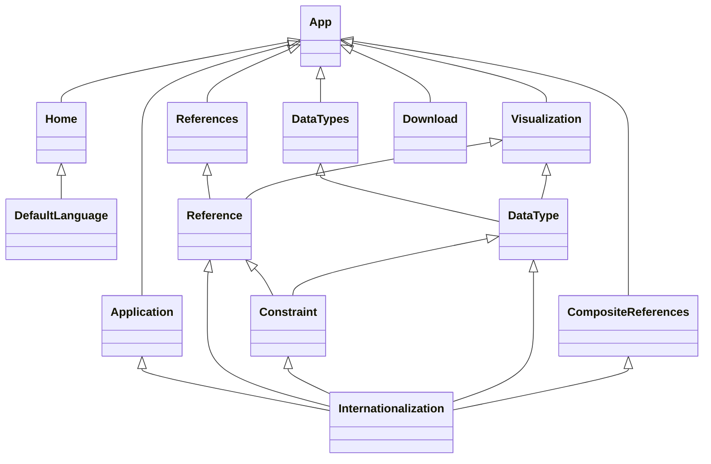

<div align="center">
  
  <h1>
    <a href="https://forgemia.inra.fr/anaee-dev/implementations-si-ore/si_v2_tools/si-ore-v2-yaml-configuration">
      Application YAML
    </a>
  </h1>
  <p>
    Application permettant de générer le fichier de configuration pour OpenADOM.
  </p>
  <p>
    <strong>Développé par Antoine Delahaye.</strong>
  </p>
</div>

<br/>

<details>
  <summary>Sommaire</summary>
  <ol>
    <li>
      <a href="#pour-commencer">Pour commencer</a>
      <ul>
        <li><a href="#prérequis">Prérequis</a></li>
        <li><a href="#commandes-utiles">Commandes utiles</a></li>
      </ul>
    </li>
    <li>
      <a href="#à-propos">À propos</a>
      <ul>
        <li><a href="#dépendances">Dépendances</a></li>
        <li><a href="#fonctionnement">Fonctionnement</a></li>
        <li><a href="#maintenance">Maintenance</a></li>
      </ul>
    </li>
  </ol>
</details>

## Pour commencer

### Prérequis

- NodeJS
  ```shell
  # Debian
  sudo apt install nodejs
  
  # Arch
  sudo pacman -S nodejs
  ```

- NPM
  ```shell
  # Debian
  sudo apt install nodejs
  
  # Arch
  sudo pacman -S nodejs
  ```

- Pandoc
  ```shell
  # Debian
  sudo apt install pandoc texlive
  
  # Arch
  sudo pacman -S pandoc texlive-core
  ```

### Commandes utiles

#### Installer le projet

```shell
npm install
```

#### Lancer le serveur en mode développement

```shell
npm run dev
```

#### Lancer Cypress

```shell
cypress open
```

#### Générer le PDF du rapport

```shell
pandoc docs/REPORT.md -o docs/files/Rapport.pdf --filter mermaid-filter --highlight-style tango
```

#### Générer le PDF de la documentation utilisateur

```shell
pandoc docs/USER_DOC.md -o docs/files/Manuel\ utilisateur.pdf
```

## À propos

### Dépendances

- [Vite](https://vitejs.dev/)
- [VueJS](https://vuejs.org/)
- [Vue Router](https://router.vuejs.org/)
- [Pinia](https://pinia.vuejs.org/)
- [Vuetify](https://next.vuetifyjs.com/)
- [Vue i18n](https://vue-i18n.intlify.dev/)
- [Cypress](https://www.cypress.io/)
- [Vue3 Cookies](https://github.com/KanHarI/vue3-cookies)
- [YAML](https://github.com/eemeli/yaml)
- [FileSaver.js](https://github.com/eligrey/FileSaver.js)

### Fonctionnement

#### Structure de l'application



#### Vues

- App

Contient l'entête de la page, la barre de navigation et la vue du routeur. En fonction de la route
demandée, la vue correspondante est affichée.

- Home

Il s'agit de la vue par défaut. Elle affiche une carte permettant d'importer un fichier YAML existant ou de créer un
nouveau fichier YAML.

- Application

Permet de choisir le nom de l'application et donne des informations sur la version et la langue par défaut.

- References

Contient un tableau avec toutes les références et des boutons permettant d'ajouter, de supprimer et de modifier une
référence ainsi que d'importer un fichier CSV afin de créer automatiquement des colonnes pour une référence.

- DataTypes

Contient un tableau avec tous les types de données et des boutons permettant d'ajouter, de supprimer et de modifier un
type de données.

- CompositeReferences

Contient un tableau avec toutes les références composites et des boutons permettant d'ajouter, de supprimer et de
modifier une référence composite.

- Visualization

Permet de visualiser la structure du fichier de configuration afin d'avoir une vue d'ensemble sur ce dernier. Il permet
aussi de naviguer rapidement dans certains éléments.

- Download

Permet de télécharger le fichier de configuration.

#### Composants

- DefaultLanguage

Permettant de choisir la langue par défaut lorsque l'ont créé un nouveau fichier YAML ou que celui que l'on importe ne
spécifie pas la langue par défaut.

Props

| Nom       | Type    | Défaut | Requis | Description                                                                             |
|-----------|---------|--------|--------|-----------------------------------------------------------------------------------------|
| isNewFile | Booléen | Vrai   |        | Indique si la pop-up va définir la langue d'un fichier existant ou d'un nouveau fichier |

- Internationalization

Champs permettant d'internationaliser le fichier de configuration en fonction de la langue par défaut.

Props

| Nom         | Type   | Défaut | Requis | Description                                   |
|-------------|--------|--------|--------|-----------------------------------------------|
| model       | Objet  |        | X      | Objet contenant les données des champs textes |
| label       | String |        | X      | Labels des champs textes                      |
| placeholder | String |        | X      | Placeholders des champs textes                |

- DeleteAlert

Pop-up de confirmation de suppression d'un élément.

Props

| Nom         | Type    | Défaut | Requis | Description                                                                    |
|-------------|---------|--------|--------|--------------------------------------------------------------------------------|
| selectedKey | String  |        | X      | Clé de l'objet                                                                 |
| isReference | Booléen | Vrai   |        | Indique s'il s'agit de la suppression d'un référentiel ou d'un type de données |

- Constraint

Champs permettant d'ajouter des contraintes à un référentiel ou un type de données.

Props

| Nom        | Type  | Défaut | Requis | Description                                                        |
|------------|-------|--------|--------|--------------------------------------------------------------------|
| validation | Objet |        | X      | Objet contenant la contrainte                                      |
| reference  | Objet |        |        | Objet contenant les colonnes en cas de contrainte sur les colonnes |

- Reference

Pop-up permettant d'ajouter ou de modifier un référentiel.

| Nom           | Type   | Défaut | Requis | Description                  |
|---------------|--------|--------|--------|------------------------------|
| referenceName | String |        |        | Nom de la référence à éditer |

- DataType

Pop-up permettant d'ajouter ou de modifier un type de données.

| Nom          | Type   | Défaut | Requis | Description                  |
|--------------|--------|--------|--------|------------------------------|
| dataTypeName | String |        |        | Nom de la référence à éditer |

### Maintenance

Vuetify est actuellement en beta pour Vue 3, il est donc nécessaire de mettre à jour régulièrement le framework.

<div align="center">
  
</div>