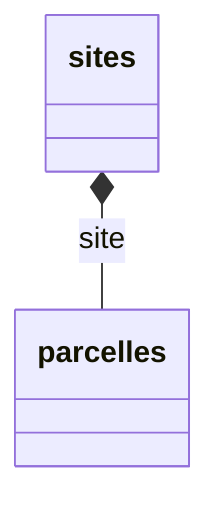
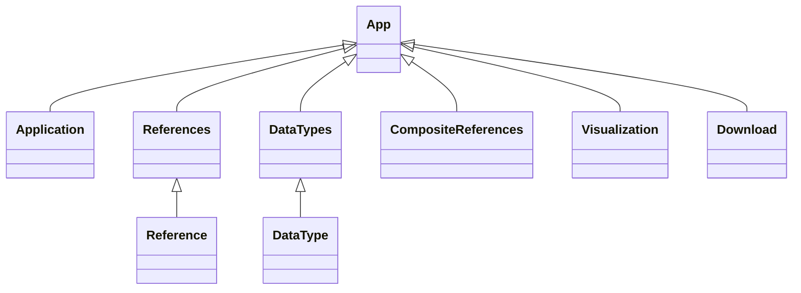

% Développement d'une application VueJS permettant de générer des fichiers de configuration pour OpenADOM
% Antoine DELAHAYE
% Stage du 04/04/2022 au 29/07/2022

# Remerciements

Je souhaite tout d’abord remercier mon maître de stage, Monsieur Philippe TCHERNIATINSKY, de m’avoir permis
de rejoindre son équipe afin de travailler sur des projets tous plus intéressants et variés les uns que les autres.

Je remercie toute l’équipe INFOSOL avec qui j’ai beaucoup appris lors de mon stage.

Je remercie aussi tout le personnel de l’INRAE avec lesquels j’ai pu travailler ou discuter.

# Introduction

Étudiant en troisième année de licence Informatique à l’Université d’Orléans, j’ai réalisé un stage de quatre mois, du 4
avril
au 29 juillet, à l'INRAE Val de Loire à Ardon, au sein de l’unité INFOSOL.

Mon rôle dans cette équipe était de m’occuper du développement d’une application web permettant l’aide
à la création de fichier de configuration pour les applications du SI ORE (Observatoire de Recherche en Environnement).

# Structure d'accueil

## L'INRAE

INRAE, l’Institut National de la Recherche Agronomique Environnementale est né le 1<sup>er</sup> janvier 2020.
Il est issu de la fusion entre l’INRA, Institut National de la Recherche Agronomique et IRSTEA, Institut national de
Recherche
en Sciences et Technologies pour l’Environnement et l’Agriculture.

L'INRA a été créé en réponse aux pénuries alimentaires provoquées par la fin de la Seconde Guerre mondiale : combiner
science
et technologie pour améliorer les techniques agricoles et d'élevage. Une fois cette question résolue, les objectifs de
l'INRA
ont changé et plusieurs missions ont été confiées à l'organisme. Ces missions couvrent un large éventail de domaines
tels
que les sols, le changement climatique, le carbone renouvelable, les systèmes agricoles à haute performance
environnementale, l'eau, la biodiversité, l'alimentation humaine, les biotechnologies végétales et les maladies
émergentes.

En février 2018, les présidents d'IRSTEA et de l'INRA sont chargés par les ministres de l'Agriculture et de la Recherche
de fusionner leurs deux instituts en une seule entité, et d'ici à 2020 leurs recommandations ont été formulées dans un
rapport
au régulateur en octobre 2018. En 2019, il a été annoncé que le 1<sup>er</sup> janvier 2020, l'organisation combinée
serait connue
sous le nom d'Institut national de l'agronomie de l'environnement (INRAE). Le décret de fusion formelle a été signé
le 10 octobre 2019 et la fusion a pris effet le 1<sup>er</sup> janvier 2020.

Aujourd'hui l'INRA regroupe dix-huits centres régionaux (en plus de son siège à Paris) répartis sur plus de
150 sites et emploi environ 8200 titulaires ainsi que de nombreux doctorants (environ 500) et stagiaires (environ 2600).

Pour ce qui est de l'INRAE Val de Loire, elle compte 800 agents dont 632 titulaires et regroupe quatre pôles :

- Dynamique des sols et gestion de l'environnement
- Biologie integrative des arbres et organismes associés
- Infectiologie et one health
- Biologie animale intégrative et durabilité des systèmes d'élevage

## L'unité INFOSOL

J'ai donc réalisé mon stage au sein de l'équipe ORE, cette dernière fait partie de l'unité INFOSOL. Les activités de
l'unité INFOSOL s'exercent dans le cadre de la participation de l'INRAE à un Groupement d'Intérêt Scientifique Sol (GIS
Sol)
qui propose un ensemble de programmes nationaux pour faciliter et encourager une gestion patrimoniale et durable des
sols.

L'unité INFOSOL réalise ou coordonne l'acquisition des données nécessaires à la constitution de ce
système d'information. Elle assure le contrôle de la qualité de ces données. Elle crée et alimente les
bases de données permettant l'archivage et l'exploitation des informations. Elle assure l'accès aux
demandeurs dans le respect des règles de la déontologie et des conventions passées avec les
partenaires des programmes qu'elle conçoit. Elle contribue à leur diffusion et à leur valorisation en
assurant notamment l'articulation avec les bases de connaissances sur les sols et les outils
d'exploitation thématique produits par les recherches de l'Institut.

# Environnement de travail

Afin de pouvoir travailler dans de bonnes conditions, j'ai partagé pendant ma période de stage un bureau de travail avec
Madame BOUKIR Hakima, développeuse pour l'équipe SI Sol.


Concernant mon outil de travail, il s'agit d'un ordinateur portable Dell de 15,6 pouces sous Linux afin d'installer tous
les paquets necessaries pour faire du développement d'application web. En plus de ça, j'ai à disposition une station
d'accueil à mon bureau afin de pouvoir brancher un écran externe de 27 pouces, un clavier et une
souris, tout en alimentant mon ordinateur avec un seul cable.


# Sujet

## Introduction

Comme expliqué precedent, la mission générale de l'unité INFOSOL est de constituer et de gérer un
système d'information à vocation nationale et européenne sur les sols, par rapport à leur distribution spatiale, leurs
propriétés et l'évolution de leur qualité. La mission de l'unité a été élargie aux données environnementales et aux
données des pratiques culturales. De ce fait, afin de répondre à ces exigences, l'équipe des ORE a été chargé de
développer outil permettant de gérer ces données. C'est de là qu'est né OpenADOM (Application for Data Organization and
Management).

OpenADOM est donc avant tout une API REST, c'est-à-dire un style d'architecture logicielle définissant un ensemble de
contraintes à utiliser pour créer des services web permettant de générer une application pour stocker, gérer et
visualiser
des données à partir d'un fichier de configuration. Ce fichier de configuration permettant de décrire les données à
stocker, leurs types, leurs relations, leurs relations entre les données, leurs relations avec des données, ect.
Le format utilisé par ce fichier est le YAML, il s'agit d'un format de représentation de données simple et facile à
comprendre. Cependant, l'écriture d'un tel fichier est très fastidieuse. En effet, ce dernier relativement
complexe étant donné qu'il est chargé de décrire la structure d'une application, il est possible de se retrouver avec
des fichiers faisant plusieurs milliers de lignes.

```yaml
version: 1
application:
  defaultLanguage: fr
  internationalizationName:
    fr: SOERE mon SOERE avec dépôt
    en: SOERE my SOERE with repository
  name: MONSORE
  version: 1
compositeReferences:
  sites:
    components:
      - reference: type_de_sites
        parentRecursiveKey: null
      - parentKeyColumn: tze_type_nom
        parentRecursiveKey: zet_chemin_parent
        reference: sites
  projet:
    components:
      - reference: projet
```

C'est donc à partir du constat que la création d'un tel fichier est se révèle trop complexe qu'il m'a été demandé de
développer une application permettant de guider pas à pas l'utilisateur dans la création de ce fichier. Ainsi, lors
d'une
des réunions hebdomadaires du SI ORE, il a été décider avec mon maitre de stage et notre directeur d'unité Monsieur
SCHELLENBERGER Antoine d'établir un rétroplanning afin de gérer au mieux les tâches à réaliser dans le temps imparti de
mon stage. De ce fait, il a été convenu de me laisser jusqu'à la mi-avril afin d'étudier et de comprendre le
fonctionnement
d'un fichier de configuration pour être capable d'en construire un par moi-même, jusqu'a la mi-mai pour concevoir des
maquettes et ensuite jusqu'à la fin de mon stage pour développer et écrire la documentation de l'application.

## Structure du fichier de configuration

Afin de comprendre correctement le sujet du stage, il est nécessaire d'apporter du vocabulaire et de détailler la
structure
d'un fichier. En effet, le fichier contient cinq parties permettant de décrire l'application :

- version

La version de l'analyseur du fichier de configuration (0, 1, 2, ...). Cette partie est propre au format
YAML. En effet, tout fichier YAML comporte cette "clé" qui permet de savoir quelle version du format est utilisé étant
donné que le style d'écriture du format YAML a évolué au fil du temps. Dans le cadre de OpenADOM, la version 1 est celle
par défaut.

```yaml
version: 1
...
```

- application

Cette partie sert à la présentation l'application avec notamment le nom de l'application, une section optionnelle
d'internationalisation
du nom de l'application, la langue par défaut et la version du fichier de configuration. Si l'on apporte des
modifications
au fichier, on incrémente la version du fichier.

```yaml
application:
  defaultLanguage: fr
  internationalizationName:
    fr: Ma première application
    en: My first application
  name: application_nom
  version: 1
```

- references

Il s'agit d'un ensemble d'informations permettant de préciser le contexte de la mesure ou de l'observation. On décrit un
référentiel de données en y listant le nom des colonnes souhaitées dans la partie `columns`, les colonnes qui forment la
clé naturelle dans `keyColumns` et on pourra aussi décrire des règles de validations sur une ou plusieurs colonnes dans
une section `validations` qui sera détailler plus tard. De plus, des sections d'internationalisation optionnelle peuvent
être détaillées.

```yaml
references:
  especes:
    internationalizationName:
      fr: Espèces
      en: Species
    internationalizedColumns:
      esp_definition_fr:
        fr: esp_definition_fr
        en: esp_definition_en
    internationalizationDisplay:
      pattern:
        fr: '{esp_nom}'
        en: '{esp_nom}'
    keyColumns:
      - esp_nom
    columns:
      esp_nom: null
      esp_definition_fr: null
      esp_definition_en: null
      colonne_homonyme_entre_referentiels: null
```

- compositeReferences

Une référence composite permet de définir une hiérarchie entre différentes données de référence.



```yaml
compositeReferences:
  localizations:
    components:
      - reference: sites
      - reference: parcelles
        parentKeyColumn: 'site'
```

- dataTypes

Un type de donnée se compose d'une section data permettant de décrire le schéma des données enregistrées en base, du
format
du fichier (csv, json, ...), des autorisations et les validations de chaque ligne.

## Maquettage

Afin de concevoir rapidement et efficacement des maquettes de l'application, Figma a été utilisé, il s'agit d'un
éditeur de graphiques vectoriels et d'un outil de prototypage.

Dans un premier temps, je suis parti sur dès maquettes sans règles de design spécifiques mis à part de respecter les
couleurs et polices d'écriture de l'INRAE. La disposition était très simple avec un entête, au milieu le contenu de page
sur un fond blanc et entre l'entête et le contenu, une barre de navigation.


Cependant, je me suis rapidement rendu compte de ses principaux défauts qui été de ne pas suivre de règles de design et
d'avoir une interface beaucoup trop simpliste qui n'allait pas permettre d'évoluer rapidement. J'ai donc décidé après
avoir produit trois maquettes de partir sur un nouveau design de maquettes repentant des règles de design.

Après de longue recherche, j'ai décidé d'utiliser Material Design afin d'unifier le style de l'application. Material
Design est un ensemble de règles de design fourni par Google afin de concevoir des interfaces de qualité plus
rapidement.
C'est donc grâce à des composants de Material Design que j'ai pu reprendre le maquettage de mon application et rattraper
le temps perdu à changer de règles de design.


J'ai donc pu grâce, aux retours qui m'avaient été fait lors de la première présentation des maquettes, retravailler ces
dernières, notamment par rapport au nommage des pages et à la navigation. Même si la structure reste la même avec un
entête aux couleurs de l'INRAE et une carte centrale avec le contenu de la page, j'y ai ajouté une barre de navigation
latérale et supprimer celle entre le contenu de la page et l'entête afin de bien délimiter le contenu de la navigation.

Ainsi nous avons la page d'accueil pour choisir si l'on veut créer un nouveau fichier ou bien importer un fichier
existant, la page d'application qui contient deux champs de textes afin d'internationaliser le nom de
l'application et une boite à cocher si on veut que l'anglais soit la langue par défaut et pour ce qui est de la page des
références, nous avons un tableau affichant le nom des références, le nombre de colonnes, les colonnes clés et des
boutons d'actions.

Après avoir terminé le design de la page des références, je me suis attelé à concevoir une boite de dialogue
pour ajouter des références. En effet, je souhaitais avoir une boite de dialogue pour ajouter des références et non une
nouvelle page pour ça. Cependant, ayant déjà une idée de la disposition général qu'allait prendre cette page et n'ayant
pas de visibilité sur la partie technique de l'application et donc de ce qui allait être possible de faire, je décidai
de commencer le développement d'un premier prototype afin de présenter une première version fonctionnelle des maquettes.

## Développement et tests

Avant de pouvoir commencer à développer un premier prototype, une phase de recherche concernant le framework UI à
utiliser a été nécessaire, ce framework doit bien évidement respecter les règles de Material Design. Un framework UI est
un ensemble de composants qui permettent de développer des interfaces utilisateur. En effet, utiliser un framework UI
respectant Material Design va me permettre d'avoir à disposition des composants déjà construits afin de faciliter le
développement, c'est ce que propose Vuetify, le framework UI le plus populaire. Un dès autre aspect technique important
est le fait d'utiliser VueJS étant donné que OpenADOM utilise
déjà VueJS et qu'il est nécessaire que cette application soit accessible partout sans avoir à installer un logiciel.
Quant à VueJS, il s'agit d'un framework JavaScript qui permet de construire des interfaces utilisateur et des
applications web mono-pages. Pour ce qui est de la version utilisée, il s'agit de la version 3 de VueJS, cette dernière
apporte des améliorations notables sur les performances, la taille de l'application et la facilité de développement. De
plus, j'ai utilisé Vite, un outil de développement de dernière génération permettant d'améliorer la vitesse construction
du projet, par exemple lorsqu'on modifie un fichier qui influe sur la disposition de l'interface, ces modifications sont
directement visibles.

J'ai donc dans un premier temps installé Vite ainsi que VueJS afin d'avoir la base de mon application, cela se fait très
simplement en suivant la documentation de Vite. La partie un peu plus ardue de l'installation viens de Vuetify. En
effet, un framework UI nécessite un peu de configuration pour fonctionner correctement, notamment avec Vite afin que ce
dernier puisse optimiser Vuetify pour le rechargement des pages.

Par exemple, ce bout de code va permettre de construire un thème personnalisé pour l'INRAE avec la definition des
couleurs.

```typescript
export const inrae: ThemeDefinition = {
    dark: false, // On définit si le thème est sombre ou non
    colors: {
        background: '#ffffff', // Couleur de fond
        surface: '#ffffff', // Couleur de surface
        primary: '#00a3a6', // Couleur primaire
        error: '#df463a' // Couleur d'erreur
    }
}
```

Ainsi, après avoir définie le thème, ce dernier est importé dans un fichier nommé `main.js`, c'est lui qui va permettre
de charger et paramétrer les différents frameworks utilisés.

Une fois cela fais, j'ai peu m'attaquer à la structure de mon application. Lors d'une précédente réunion, il a été
défini que l'application avait besoin de sept pages, une page application pour le nom et la langue, une page pour les
références, une pour les types de données, une pour les références composite, une page permettant de visualiser
l'évolution du fichier et enfin une pour télécharger le fichier. De ce fait, sept composants ont été créés, un pour
chaque page. Un composant VueJS correspond à une instance réutilisable d'un composant HTML, c'est-à-dire que c'est à
l'intérieur d'un composant qu'on va écrire le code HTML et JavaScript pour une page en question et il va être possible
par la suite d'appeler se composant pour l'afficher. Avec cela, on va donc installer Vue Router afin de faire
correspondre une route à un composant et donc de permettre de naviguer entre les différentes pages. Par exemple, si on
veut aller sur la page des références, on va avoir `https://mon_application.fr/references` ou `references` correspond à
la route.

Ce code permet de lier une route à un composant.

```javascript
const router = createRouter({
    history: createWebHistory(),
    routes: [
        {path: '/', component: Home},
        {path: '/application', component: Application},
        {path: '/references', component: References},
        {path: '/data-types', component: DataTypes},
        {path: '/composite-references', component: CompositeReferences},
        {path: '/visualization', component: Visualization},
        {path: '/download', component: Download}
    ]
})
```

Après avoir configuré le projet pour avoir une application fonctionnelle, j'ai pu attaquer le développement de
l'interface grâce aux composants cités précédemment. En effet, chaque composant possède trois parties, une partie pour
le code JavaScript, une partie pour le code HTML et une pour le code CSS. Cela permet de tout regrouper dans un seul et
même fichier et ainsi chaque composant aura son code qui lui ait propre. Mais cela n'est pas vrai pour tous les
composants, en effet il existe un composant qui n'a pas évoqué, il s'agit du composant `App`. Ce dernier est présent sur
n'importe quel projet VueJS, c'est en quelque sorte le composant principal sur lequel les autres composants vont
s'articuler grâce aux routes. La réutilisabilité étant un des concepts clé de VueJS, cela va permettre de réutiliser des
éléments présents sur chaque page, comme la barre navigation ou l'entête sans avoir à réécrire le même code à chaque
fois.

Ce diagramme représente la structure de l'application. Reference et DataType seront détaillés plus tard.



Comme expliqué precedent, je me suis d'abord attardé sur l'aspect visuel plutôt que la partie fonctionnelle de
l'application. C'est-à-dire que j'ai fait en sorte que l'on puisse naviguer dans l'application afin de pouvoir présenter
un apercu de l'application et d'avoir un retour sur cette dernière.

Une fois que le visuel validé, j'ai pu m'atteler à la partie fonctionnelle de l'application. Ici cela fait référence au
fait de stocker les données du fichier, pour ce faire le format JSON a été utilisé. Le JSON est un format
standard utilisé pour représenter des données structurées de façon semblable aux objets Javascript. Étant donné qu'il
est très facile de convertir du YAML en JSON et inversement, cela va permettre d'avoir un objet que l'on va pouvoir
manipuler pour ajouter nos données et qu'on pourra donc par la suite convertir en YAML, de même pour importer un fichier
existant que l'on pourra convertir en JSON.

Afin de stocker cet objet et qu'il soit accessible dans chaque composant, il est nécessaire d'utiliser Pinia. Il s'agit
d'un gestionnaire d'état et une bibliothèque pour des applications VueJS. Il sert de zone de stockage de données
centralisée pour tous les composants dans une application. C'est donc grâce à Pinia que l'ont défini un store, ce store
va représenter notre objet JavaScript. Dans ce store, on va aussi pouvoir ajouter des getters afin de récupérer des
données depuis le store et des actions afin d'agir avec l'objet.

```javascript
export const useYamlStore = defineStore({
    id: 'yaml',
    state: () => ({
        application: {
            defaultLanguage: 'fr',
            internationalizationName: {
                fr: null,
                en: null
            },
            name: null,
            version: 1
        },
        compositeReferences: {},
        references: {},
        dataTypes: {}
    }),
    getters: {
        getYaml() {
            return {...}
        }
    },
    actions: {
        setYaml(yaml) {
        },

        resetYaml() {
        },

        addReference(index, reference) {
        }
    }
})
```

Ainsi, nous avons la page d'accueil qui permet de créer un nouveau fichier ou bien de charger un fichier existant.


La page d'application quant à elle permet de donner un nom à l'application et de définir la langue par défaut. Chaque
champ de texte est directement relié à l'objet JSON, ce qui permet de modifier en temps réel les données sans avoir
besoin de bouton de validation.


Une des pages les plus importantes, cette dernière va permettre de visualiser les références, une référence possède des
colonnes, des contraintes et des colonnes clés, on affiche ces informations pour chaque référence dans un tableau. Il y
a aussi possibilité d'éditer ou de supprimer une référence. Un bouton permettant d'ajouter une nouvelle référence est
aussi présent en dessous du tableau.


Afin ajouter ou éditer une référence, on utilise une boite de dialogue comprenant tous les champs nécessaires pour cette
dernière. Cette boite de dialogue étant la même pour ajout et édition, un composant nommé Reference a été créé comme on
peut le voir sur le diagramme reprenant la structure de l'application. On va donc pouvoir remplir les champs nécessaires
comme le nom de la référence, les colonnes ou même les contraintes afin ajouter une référence.


Un aspect important de l'application est la présence de validateur permettant de savoir quelle sont les requis.


## Documentation

# Bilan

# Conclusion